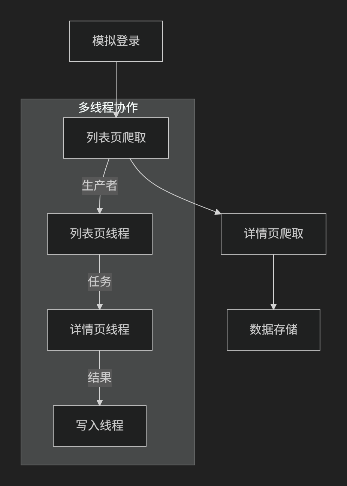

# National University Student Employment Service Platform Job Crawling
​	这是一个基于Python的多线程爬虫项目，专门用于从“国家大学生就业服务平台”（NCSS）自动化抓取岗位数据。项目通过Selenium模拟登录、维护会话状态，并结合多线程架构高效爬取列表页和详情页数据，最终将结构化结果按日期存储。
（**刚毕业的菜鸟随便弄的玩意 T^T **）

## 一、项目目标与技术栈

1. ### **核心功能**

   - 自动化登录NCSS平台，绕过反爬机制维持有效会话。
   - 分页爬取岗位列表（包括职位名称、薪资、学历要求等基础信息）。
   - 并发抓取每个岗位的详情页数据（如岗位介绍），合并为完整记录。
   - 按日期分目录存储JSON格式数据，便于后续分析。

2. ### **技术栈**

   - **Selenium**：模拟浏览器登录，获取动态生成的Cookie
   - **urllib3**：高效HTTP连接池管理（50连接复用），支持超时重试
   - **多线程（threading）**：生产者-消费者模型实现任务并行处理
   - **BeautifulSoup**：解析HTML详情页提取“岗位介绍”文本

## 二、系统架构与工作流程

1. ### **三层线程架构**

   -    **列表页线程（生产者）**：工作线程从队列获取页码，调用API分页抓取岗位基础数据，生成详情页任务
   -    **详情页线程（消费者）**：工作线程并发请求详情页HTML，解析并合并数据（IO密集型任务）
   -    **写入线程**：单线程顺序写入文件，避免磁盘竞争，每100条数据刷盘确保安全

1. ### **队列管理**

   - 使用`Manager`创建共享队列：`list_page_queue`（页码任务）、`detail_task_queue`（岗位基础数据）、`result_queue`（完整数据）
   - 队列容量控制（详情队列最大5000），防止内存溢出
## 三、核心模块详解
1. ### **登录与会话维持**

   - 通过Selenium操控Chrome输入账号密码，登录后提取动态Cookie（如`SESSION`）
   - 合并静态Cookie（如`_ga`、`cna`）与动态字段，按平台要求严格排序拼接为完整Cookie字符串
   - 使用`detach=True`保持浏览器不关闭，维持登录状态

2. ### **数据抓取与解析**

   - **列表页API请求**：添加动态时间戳参数防反爬，处理403/401过期状态
   - **详情页解析**：定位`<pre class="mainContent">`提取岗位介绍文本，合并到基础数据中
   - **反爬策略**：随机请求延迟（列表页0.5-1.5秒，详情页0.3-0.8秒），轮换User-Agent（`fake_useragent`库）

3. ### **错误处理与重试**

   - 全局变量`list_get_wrong`/`detail_get_wrong`记录失败页码或岗位ID
   - 请求异常时休眠重试（列表页5秒，详情页3秒）